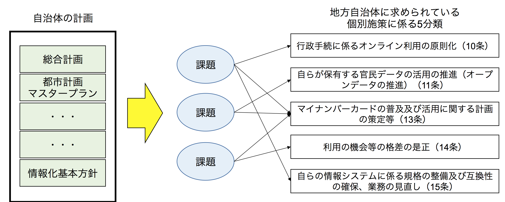
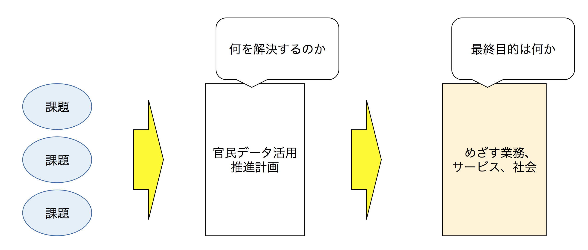
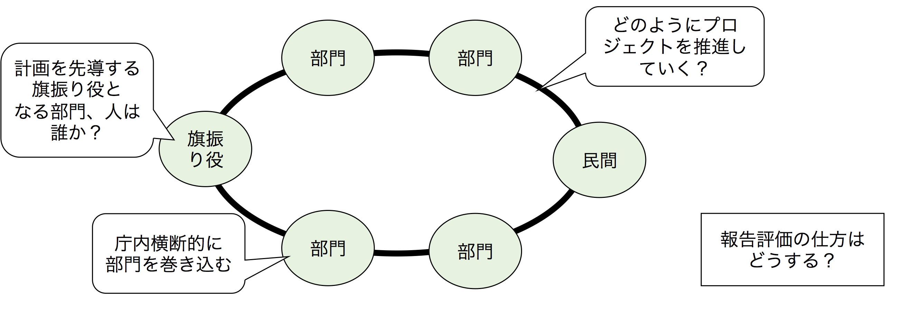
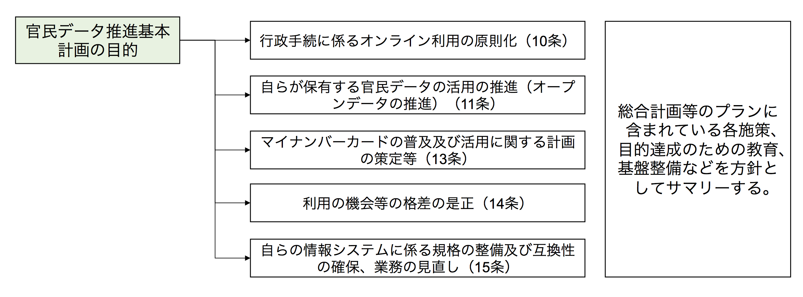

# 官民データ推進基本計画勝手ガイドライン(自治体向け)

| ⚠️ This repository has been archived and will no longer be maintained. Thanks for all the stars, help and brainstorms! |

| 作成日 | 2017/12/21 |
|---|---|
| ステータス | ドラフト |

## 全体の構成

### 1. [（自治体）の現状及び課題](issues.md)

まずは、現状及び課題を再確認する。

各計画を元に課題一覧を作成して、官デ法の対応項目に紐づけ、何に対して計画を立てるのか明確にする。

### 2. [（自治体）官民データ活用推進計画の目的](purpose.md)
「官民データ活用推進計画」を立てる目的を明確にする

### 3. [（自治体）官民データ活用推進計画の位置付け](role.md)

自治体の総合計画や都市計画マスタープランとの紐付けを明確にする。

### 4. [（自治体）官民データ活用推進計画の推進体制](structure.md)

官民データ推進基本計画は、情報部門だけでなく、課題・計画に関わる全部門を推進体制として巻き込む。

### 5. [官民データ活用の推進に関する策定の基本的な方針](master_plan.md)

現状及び課題で紐付けた、５分類について方針を詳細化する。

この後、６の個別施策と行ったり来たりしながら精度を高める。

### 6. [官民データ活用の推進に関わる個別施策](detail_plans.md)

### 7. [セキュリティ及び個人情報の適切な取り扱いの確保](securities.md)
