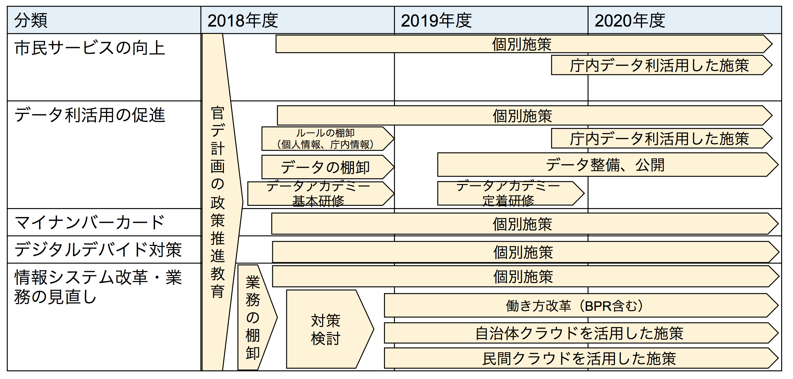

# 官民データ活用の推進に関する策定の基本的な方針

何年間の計画なのかを明確にする。  
既存計画との整合性も合わせて、3年、5年決める

５分類については、既に計画されている施策だけでなく、まだ計画が立っていないものについては、６の個別施策の例から自治体で取り組めるものをスモールスタートで組み込む。

## 対応予定の施策と追加施策をまとめる

### 電子行政
#### 行政手続に係るオンライン利用の原則化（10条）

* [ ]マイナポータルの活用による各種申請の電子化促進
* [ ]住民税の特別徴収税額通知（特別徴収義務者用）の電子化
* [ ]タブレットを活用した行卯手続の電子化の取り組み
* [ ]行政手続の棚卸し
* [ ]図書館関連業務に係る電子化の取り組み

#### 自らが保有する官民データの活用の推進（オープンデータの推進）（11条）

* [ ]各種保有情報等に係るオープンデータ化の促進
* [ ]保有する各種地理空間情報等に係るオープンデータ化の推進
* [ ]地域におけるビッグデータ利活用の推進
* [ ]ごみ分別情報のオープンデータ化の推進

#### マイナンバーカードの普及及び活用に関する計画の策定等（13条）

* [ ]マイナンバーカードの企業等一括申請等による所得促進
* [ ]窓口業務に関するBPRの推進
* [ ]マイナンバーカードを活用した情報セキュリティの確保
* [ ]コンビニ交付サービスの導入及び発行証明書類の拡大
* [ ]マイナンバーカードの取得率及び住民利便性の向上

#### 利用の機会等の格差の是正（14条）

* [ ]IoTに関する地域における学習環境作りの推進
* [ ]IoT地域実装のための総合的支援施策の活用・周知
* [ ]Webアクセンシビリティ確保のための環境整備
* [ ]Webサイト改修への市民参加の取組

#### 自らの情報システムに係る規格の整備及び互換性の確保、業務の見直し（15条）

* [ ]利用者中心の業務改革（BPR）の推進
* [ ]システム構築における民間サービス利用の促進
* [ ]基幹系業務等に係る情報システムにおけるクラウド導入の促進
* [ ]「校務系」と「授業・学習系」システムの情報連携の推進
* [ ]業務のデジタル化、ペーパレス化の推進
* [ ]情報システムや保有データの標準化の推進
* [ ]地域情報プラットフォーム標準仕様の導入
* [ ]中間標準レイアウト仕様の活用

#### パーソナルデータの利活用の環境整備に関わる取り組み等

* [ ]非識別加工情報の提供の仕組みの導入
* [ ]官民データ活用施策の推進に向けた職員の研修・育成
* [ ]CIO等における外部人材を含むICT人材の積極登用

### 健康・医療・介護

#### 行政手続に係るオンライン利用の原則化（10条）

#### 自らが保有する官民データの活用の推進（オープンデータの推進）（11条）

#### マイナンバーカードの普及及び活用に関する計画の策定等（13条）

#### 利用の機会等の格差の是正（14条）

#### 自らの情報システムに係る規格の整備及び互換性の確保、業務の見直し（15条）

* [ ]緊急発送時における医療機関の受け入れ状況の見える化
* [ ]医療分野の研究開発に資するための匿名加工医療情報の積極的な活用

#### パーソナルデータの利活用の環境整備に関わる取り組み等

### 観光

#### 行政手続に係るオンライン利用の原則化（10条）

#### 自らが保有する官民データの活用の推進（オープンデータの推進）（11条）

#### マイナンバーカードの普及及び活用に関する計画の策定等（13条）

#### 利用の機会等の格差の是正（14条）

#### 自らの情報システムに係る規格の整備及び互換性の確保、業務の見直し（15条）

#### パーソナルデータの利活用の環境整備に関わる取り組み等

* [ ]IoTを活用した○○地域観光の推進

### 農林水産

#### 行政手続に係るオンライン利用の原則化（10条）

#### 自らが保有する官民データの活用の推進（オープンデータの推進）（11条）

#### マイナンバーカードの普及及び活用に関する計画の策定等（13条）

#### 利用の機会等の格差の是正（14条）

#### 自らの情報システムに係る規格の整備及び互換性の確保、業務の見直し（15条）

* [ ]IoTを活用した鳥獣被害対策
* [ ]ICTを活用した次世代水産業の推進

#### パーソナルデータの利活用の環境整備に関わる取り組み等

### 金融

#### 行政手続に係るオンライン利用の原則化（10条）

#### 自らが保有する官民データの活用の推進（オープンデータの推進）（11条）

#### マイナンバーカードの普及及び活用に関する計画の策定等（13条）

#### 利用の機会等の格差の是正（14条）

#### 自らの情報システムに係る規格の整備及び互換性の確保、業務の見直し（15条）

#### パーソナルデータの利活用の環境整備に関わる取り組み等

### 防災・減災

#### 行政手続に係るオンライン利用の原則化（10条）

* [ ]道路管理におけるセンサー利用による業務効率の改善の取組

#### 自らが保有する官民データの活用の推進（オープンデータの推進）（11条）

#### マイナンバーカードの普及及び活用に関する計画の策定等（13条）

#### 利用の機会等の格差の是正（14条）

* [ ]防災拠点におけるWi-Fi環境の設備推進
* [ ]条件不利地域における携帯電話のエリア整備の推進
* [ ]超高速ブロードバンド未整備地域における整備
* [ ]確保の推進
* [ ]市内におけるフリーWi-Fiの整備

#### 自らの情報システムに係る規格の整備及び互換性の確保、業務の見直し（15条）

* [ ]ゲリラ豪雨に対するIoTを活用した取組

#### パーソナルデータの利活用の環境整備に関わる取り組み等

### 移動

#### 行政手続に係るオンライン利用の原則化（10条）

#### 自らが保有する官民データの活用の推進（オープンデータの推進）（11条）

#### マイナンバーカードの普及及び活用に関する計画の策定等（13条）

#### 利用の機会等の格差の是正（14条）

#### 自らの情報システムに係る規格の整備及び互換性の確保、業務の見直し（15条）

#### パーソナルデータの利活用の環境整備に関わる取り組み等

### その他

#### 行政手続に係るオンライン利用の原則化（10条）

#### 自らが保有する官民データの活用の推進（オープンデータの推進）（11条）

* [ ]オープンデータを利用した地域課題解消の取組

#### マイナンバーカードの普及及び活用に関する計画の策定等（13条）

#### 利用の機会等の格差の是正（14条）

* [ ]双方向通信端末の設置による高齢者等の安全・安心の確保

#### 自らの情報システムに係る規格の整備及び互換性の確保、業務の見直し（15条）

#### パーソナルデータの利活用の環境整備に関わる取り組み等

* [ ]シェアリングエコノミーサービスを活用した地域課題解決

## 次に、今回の官民データ推進基本計画を達成するために必要な施策を追加する。

## 上記の個別施策について、内容、KPI、日程を書き込む。

## 国や県の施策内容、補助などを確認する。

## 最後に、スケジュール表に埋め込み、整合性の確認する。
各個別施策を計画に当てはめる。

各個別施策の例

